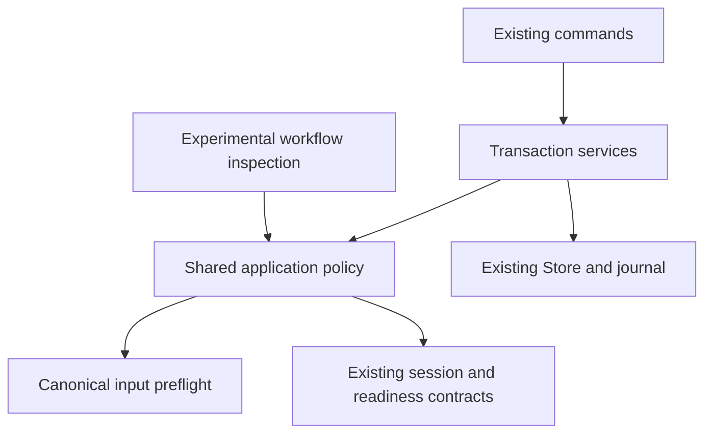

# Application policy extraction (slice 2)

Base: experimental integration commit `3753b691` (PR #192). Branch: `codex/agent-workflows-02-application`.

## File ownership

| File | Responsibility |
| --- | --- |
| `src/contracts/workspace/application-intents.ts` | Existing command boundary checks: confirmation, revisions, claim owner and supported handoff/status targets |
| `src/contracts/workspace/application-preflight.ts` | Existing readiness evaluation over canonical documents and a narrow resume observation port |
| `src/contracts/workspace/application-policy.ts` | Read-only selection, acquisition, restart, recovery, progress, handoff and direct transition guards; session construction and direct transition record validation |
| `src/workspace-core/claims.ts` | Existing transaction entry points, claim minting, heartbeat, input confirmation, journal commit and authority consumption |
| `src/workspace-core/job-transitions.ts` | Existing transaction and persistence for direct status edits |
| `src/workspace-core/job-preflight.ts` | Compatibility export for existing imports |
| `src/workflows/applications/context.ts` | Inspect supplied application candidates with the shared guards and project detached context without applicant values or private capabilities |
| `tests_js/workspace_application_policy.test.mjs` | Status matrix, intent, revision, claim, input drift, readiness, safe handoff and inspection invariants |
| `tests_js/workspace_application_policy_support.mjs` | In-memory fictional documents and persistence spies |
| `tests_js/workspace_application_context_native.test.mjs` | Disposable native Store lifecycle from selection through review restart and safe pause |

All seven TypeScript modules have checked-in generated runtime counterparts. Shared rules live below both service and workflow callers in `contracts/workspace/`; services never import the workflow leaf. This refines the initial destination sketch to preserve the repository's dependency direction rule.

## Contract and limits

The context is a projection of the canonical job and claim. It does not introduce a persisted phase or a second transition table. It preserves exact revisions as decimal strings and marks leaving unsafe while this job has a claim or remains `in_progress`. A successful handoff preview does not release the claim.

Callers provide at most one decoded candidate per operation kind, including its original expected revision, confirmation and incoming session evidence. The returned `allowedActions` describes those exact candidates only. No generic availability is inferred for a different payload. Candidate association and host intent binding are the future gateway's responsibility. No installed skill or command currently consumes this context, and the returned tool IDs are not registered for execution yet.

Inspection is advisory. It does not grant execution authority, attest that a human approved a boolean, validate a browser write, persist workflow tasks, apply transitions, or submit applications. Commands retain their boundary checks and re-run the shared policy inside mutation transactions. Owner intent, claim tokens and file observation are trusted host inputs, never model-supplied authority. Progress and review retain current claim/session checks; readiness remains agent attested. The existing input-confirmation, heartbeat, authority and persistence code keeps its current ownership.

Expected domain rejections become fixed action IDs in `rejectedActionIds`; diagnostic strings and candidate contents are withheld. Unexpected exceptions propagate so an observation/infrastructure failure cannot become a successful inspection. The caller should treat any rejected action as unavailable and use existing public diagnostic projections when needed. Inspection does not replace the public preflight error report.

The extraction preserves command error order, no-op behavior, revision arithmetic, clock call timing, selective writes and journal boundaries for valid canonical documents. Resume observation failure behavior remains unchanged. Compatibility tests include the existing Python preflight/session oracles and native claims/recovery tests; the new tests add workflow/service agreement and no-write/redaction assertions. Installed packaging and broader gates are required before publication.

## Next boundary

Slice 3 will bind exact candidate arguments and accepted host intent to task/event revisions, implement durable replay/pause metadata, and recheck execution in a gateway. It must not treat this preview as an authorization token or reuse it after canonical inputs change. Prompt integration and measured UX comparisons remain later slices.
