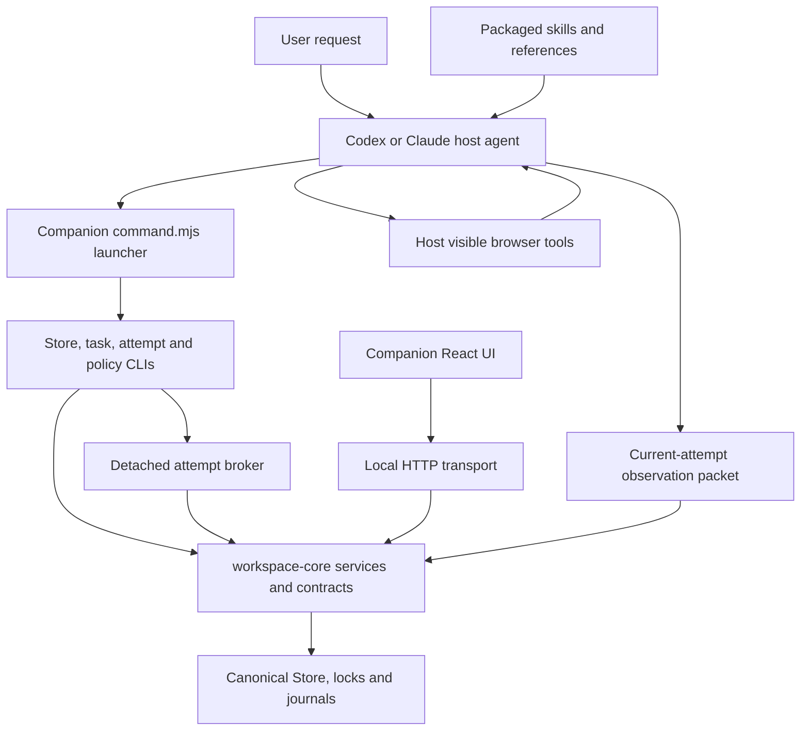

# Current plugin organization at the experiment baseline

Snapshot: remote staging `f95b4947453ad6c6abc9cc0e81c3e443706d4714` (2026-10-07 inspection).

This is a map of the existing system. Proposed files and moves are in the [experiment plan](agent-workflow-experiment-plan.md). The [TSV inventory](current-plugin-files.tsv) enumerates every tracked file under `src/`, `skills/`, `apps/companion/`, `workspace/`, `.codex-plugin/`, and `.claude-plugin/` at this commit, including emitted counterparts for TypeScript sources. It excludes dependencies and build output. Supporting test/build locations are mapped below.

## Existing system boundary

There is no general model API loop in `src/`. The host follows skill instructions and invokes tools. `task-runner.ts` runs a CLI command; it is not an LLM planner. `attempt-broker.ts` maintains claim capability and heartbeat; it is not an agent runtime. Store readiness checks validate supplied observations and explicitly identify live evidence as agent attested.

## Top-level product layout

| Location | Files at baseline | Responsibility |
| --- | ---: | --- |
| `.codex-plugin/` | 1 | Codex plugin identity, skill discovery, interface metadata |
| `.claude-plugin/` | 2 | Claude plugin identity and marketplace metadata |
| `skills/` | 46 | Nine entry skills plus task-loaded references |
| `src/cli/` | 32 | Command parsing, service dispatch, broker and server entry points |
| `src/workspace-core/` | 59 | Domain services, projections, and HTTP adapters |
| `src/contracts/` | 78 | Domain validation plus JSON/text/filesystem compatibility codecs |
| `src/store/` | 38 | Canonical persistence, file locks, journals, managed resumes, writer ownership |
| `src/final-action-policy/` | 6 | Dedicated final-action policy model, service and repository |
| `src/native/` | 5 | macOS account-flow integration and canary support |
| `src/package/` | 6 | Artifact paths, copy behavior, packaged native lock |
| `src/qa-replay/` | 5 | Replay preparation, lifecycle, oracle and policy fixture checks |
| `src/workspace-ui/` | 6 | Reusable UI projection/request helpers |
| `src/foundation.ts` | 1 | Runtime foundation export |
| `apps/companion/` | 76 | React/Next UI, local forwarding, launchers and package assembly |
| `workspace/` | 19 | Existing browser workspace HTML/CSS/JS surface and helpers |
| `runtime/` | See inventory counterparts | Checked-in JavaScript emitted from `src/`; never an independent source of behavior |

The source inventory totals 380 files in the named source/package/UI scopes, including 236 TypeScript files under `src/`. Existing compatibility codecs and development reference tooling explain the remaining Python-related names in the TypeScript tree; they are not evidence that the installed agent runs a Python model loop.

## File-level runtime map

All paths below are relative to the repository root and exist at the baseline.

| Current files | Role |
| --- | --- |
| `apps/companion/command.mjs` | Public `store`, `task`, `attempt`, `policy` dispatch; canonical writer activation before launch |
| `apps/companion/supervise.mjs`, `writer-route.mjs`, `launch.mjs` | Companion process supervision and native Store routing |
| `src/cli/native-jobs.ts` | Store command composition and dispatch |
| `src/cli/native-task.ts`, `task-runner.ts`, `task-protocol.ts`, `task-command.ts` | Task request parsing; snapshot, intake, selection and answer operation dispatch |
| `src/cli/native-task-intake.ts`, `src/workspace-core/task-intake.ts` | Canonical URL intake through job-upsert planning |
| `src/cli/native-attempt.ts`, `attempt-protocol.ts`, `attempt-broker.ts`, `attempt-authority.ts` | Stateless client protocol and detached private claim owner; heartbeat, progress, authority evaluation, handoff |
| `src/cli/native-authority.ts`, `src/workspace-core/application-authority.ts` | Grant/status/progress/evaluation operations for Autofill and Campaign to Review |
| `src/cli/native-jobs-server.ts`, `src/workspace-core/jobs-http.ts`, other `*-http.ts` files | Authenticated local HTTP parsing and delegation to shared services |
| `src/workspace-core/application-runs.ts` | One active run, bound resume/fact revisions, versioned queue, completion |
| `src/workspace-core/claims.ts` | Select/acquire/restart/progress/handoff/recovery with claim and revision checks |
| `src/workspace-core/job-preflight.ts` | Current queue, managed resume and confirmed-fact readiness checks |
| `src/workspace-core/job-transitions.ts`, `replay-transition.ts` | Owner-facing and replay transitions |
| `src/workspace-core/job-upsert.ts`, `job-upsert-plan.ts`, `job-provenance.ts`, `jobs.ts` | Canonical job mutation and provenance |
| `src/workspace-core/workspace-projections.ts`, `task-job-projection.ts` | Redacted task, activity and attention views derived from Store state |
| `src/contracts/workspace/application-runs.ts`, `application-authority.ts`, `job-input-selection.ts` | Run, grant, input-selection schemas and guards |
| `src/contracts/workspace/claims.ts`, `claim-time.ts` | Claim validation, lease timing and public projection |
| `src/contracts/workspace/claim-session.ts`, `claim-session-pending.ts`, `claim-session-readiness.ts`, `handoff-checklist.ts` | Current-attempt session construction, blockers, observation validation and handoff requirements |
| `src/workspace-core/pending-answers.ts`, `grouped-approvals.ts`, `answers.ts`, `answer-merges.ts`, `answer-lifecycle.ts`, `answer-match.ts` | Answer lookup, approval, reuse, cleanup and pending-answer resolution |
| `src/contracts/workspace/answer-*.ts`, `answers.ts` | Answer and session rules, semantic scoring and validation |
| `src/workspace-core/extraction.ts`, `extraction-context.ts`, `extraction-requests.ts`, `extraction-proposals.ts`, `extraction-proposal-state.ts` | Extraction request and proposal lifecycle |
| `src/workspace-core/resume-facts.ts`, `resumes.ts`, `resume-lifecycle.ts` | Managed resume/fact operations and owner confirmation |
| `src/workspace-core/profile.ts`, `profile-patch.ts`, `profile-preparedness.ts`, `fact-groups.ts` | Applicant profile, preferences and grouped fact operations |
| `src/workspace-core/accounts.ts`, `account-operation.ts`, `automation.ts`, `synthetic-account.ts`, `email-only-account.ts`, `trusted-fill*.ts` | Account metadata, supported automation and dedicated account-flow policies |
| `src/final-action-policy/{model,service,authorization,campaigns,outcomes,repository}.ts` | Separate policy subsystem; do not equate it with ordinary application authority or enable final submission through the refactor |
| `src/store/native-jobs.ts` | Repository composition and locked transaction surfaces |
| `src/store/native-store-state-repository.ts`, `native-store-bootstrap.ts`, `native-store-layout.ts` | Store structure, startup and canonical state access |
| `src/store/native-claim-journal.ts`, `native-claim-history.ts`, `native-answer-journal.ts`, `native-answer-resolution-journal.ts`, `native-extraction-journal.ts` | Mutation recovery and history persistence |
| `src/store/native-application-authority.ts`, `native-automation.ts`, `native-policy-tree.ts` | Authority, settings and policy persistence adapters |
| `src/store/native-resume-files.ts`, `managed-resume-*.ts`, `private-filesystem.ts`, `private-file-digest.ts` | Managed file identity, private access and observations |
| `src/store/exclusive-file-lock.ts`, `posix-flock.ts`, `process-owned-writer.ts`, `native-writer-switch.ts` | Locking and one-writer ownership |
| `src/contracts/workspace/values.ts`, `src/contracts/python-*.ts`, `raw-json/*.ts` | Shared representation and compatibility-sensitive serialization |

## File-level prompt map

| Skill or reference | Current responsibility |
| --- | --- |
| `skills/job-apply/SKILL.md` | Route extraction/application/recovery/account requests; entry boundaries |
| `skills/job-apply/references/intake.md` | Exact job selection, run setup, resume/fact binding, broker start |
| `skills/job-apply/references/application.md` | Form filling, answer use, progress and durable handoff |
| `skills/job-apply/references/browser.md` | Host browser choice, current-form consent, readback, bounded retries and visible handoff |
| `skills/job-apply/references/application-automation.md` | Guided/Autofill/Campaign modes and per-action authority evaluation |
| `skills/job-apply/references/readiness.md` | Evidence requirements before review handoff |
| `skills/job-apply/references/recovery.md` | Reviewed/blocked job continuation and explicit recovery |
| `skills/job-apply/references/extraction.md`, `profile-setup.md` | Scoped extraction and separate legacy profile setup |
| `skills/job-apply/references/consent-intents.md`, `account-readiness.md`, `account-canaries.md` | Consent interpretation, early sign-in checks, specialized account/policy boundaries |
| `skills/job-apply/references/field-mapping.md` | Interpret unfamiliar controls against confirmed data |
| `skills/job-apply/references/{ashby,greenhouse,lever,linkedin-easy-apply,rippling,workday}.md` | ATS-specific guidance loaded when relevant |
| `skills/job-apply/references/worker-delegation.md` | One filling task/worker, host/model selection, canonical handoff |
| `skills/answer-memory/SKILL.md` | Shared private Store routing and canonical access |
| `skills/answer-memory/references/{storage-contract,workflow-map,profile,resumes,answers,jobs-history,policy,qa-replay,agent-model-preferences}.md` | Shared contracts, lifecycle explanations and preference interpretation |
| `skills/job-search/SKILL.md`, `references/{sources,queue,worker-results,model-defaults}.md` | Model-driven search with bounded result/queue handoff |
| `skills/job-title-discovery/SKILL.md`, `references/{discovery-workflow,result-format}.md` | Research related titles and return an owner-reviewable packet |
| `skills/job-preferences/SKILL.md` | Owner-directed search criteria updates |
| `skills/application-setup/SKILL.md`, `references/setup-questions.md` | Durable browser/pacing/mode/model preferences; not live authority |
| `skills/account-setup/SKILL.md`, `references/supported-flows.md` | Redacted account and sign-in metadata |
| `skills/saved-jobs/SKILL.md` | Read-only canonical saved jobs |
| `skills/job-workspace/SKILL.md`, `references/workspace.md` | Open and use Companion |

## UI, adapters and test support

| Current files or scope | Role and refactor implication |
| --- | --- |
| `apps/companion/app/{page,layout}.tsx`, `components/Companion.tsx` | UI composition; preserve plugin interaction and navigation |
| `components/{Jobs,Claims,NeedsAttention,JobActivity,JobTransitions,Overview}.tsx` | Job lifecycle views; consume canonical projections |
| `components/{ApplicationAutomation,ApplicationSettings,Automation,AutomationRealm}.tsx` | Authority/preferences/account controls; distinguish saved defaults from grants |
| `components/{Resumes,ResumeFacts,Extractions,Facts,Answers,PendingAnswers,AnswerCleanup,TitleDiscovery}.tsx` | Input management, owner review and discovery handoff |
| `components/*-model.ts`, `contracts.ts`, `client.ts`, `server/*.ts`, `proxy.ts` | UI decoding, request construction and authenticated forwarding |
| `apps/companion/{readiness-packet,resume-upload-guard}.mjs` | Agent-facing observation packet and managed upload helpers |
| `workspace/features/*.js`, `workspace/lib/*.js` | Existing workspace clients; preserve compatibility during source extraction |
| `src/native/macos/account-flow-adapter.ts`, `native/macos/`, `native/posix/` | Native adapters and lock sources; platform verification when affected |
| `tools/build-runtime.mjs`, `tools/runtime-build/inventory.mjs`, `tsconfig.json` | Deterministic source-to-runtime build and stale-output checks |
| `src/package/*.ts`, `apps/companion/package-standalone.mjs`, `scripts/smoke-plugin.sh`, `scripts/smoke/*` | Installed artifact paths, package construction, isolated installation and upgrade checks |
| `config/core-workflows.json`, `.workflows/workflows/*.workflow.yaml`, `.workflows/fixtures/*` | Workflow evidence registry and synthetic journeys; not production routing |
| `src/qa-replay/*.ts`, `qa/fixtures/*`, `qa/unified_task_spine_oracle.mjs` | Replay lifecycle, controlled forms and outcome grading |
| `tests_js/native_attempt_*.test.mjs`, `workspace_native_claims*.test.mjs` | Broker, claims and recovery coverage |
| `tests_js/workspace_native_application_authority.test.mjs`, `workspace_native_job_preflight.test.mjs`, `workspace_native_task_cli.test.mjs` | Authority, inputs and public task protocol coverage |
| `tests_js/agent_workflows_*.test.mjs`, `tools/local-agent-acceptance.mjs` | Synthetic workflow contracts and actual installed-host acceptance driver |
| `tests/`, `test/contract/`, `tools/contracts/`, `config/migration/` | Existing reference contracts and migration evidence; preserve their meaning |
| `config/test-matrix.json`, `tools/test-runner/`, `.githooks/`, `.github/workflows/` | Suite ownership, local gates and CI/release orchestration |

## What is already deterministic and what is still instructed

Code already controls canonical selection, revisions, claim exclusivity, live grants, journaled mutations, session validation and review handoff. These should be reused.

Skill prose currently coordinates request routing, the browser filling loop, post-readiness consent sequencing, recovery choices, campaign progression and wording. Some of those decisions can become explicit workflow events and guards. Field interpretation and observation of unfamiliar live forms will continue to involve the host model.

For example, `claim-session-readiness.ts` recomputes a report from the supplied form packet; it does not inspect the browser itself. `ApplicationAuthorityService.evaluate()` validates a requested action group but does not execute the browser write. The new architecture must preserve that distinction until a real adapter joins authorization, execution and readback.
