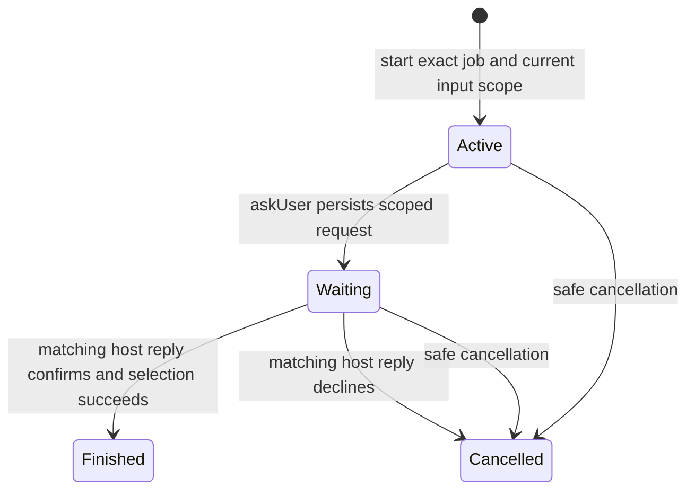

# Durable preparation protocol (slice 3a)

Branch: `codex/agent-workflows-03-durable`, stacked on PR #193 at `bbca17d951c05312d1e799ba53c7fd9106e86158`. The PR base is `codex/agent-workflows-02-application` until that dependency is merged into the experimental integration branch.

Slice 3 is split at its persistence boundary. This slice implements durable preparation and selection in one `jobs.json` replacement. Slice 3b must coordinate claim acquisition, recovery, progress and handoff with the existing claim journal before exposing those operations through the gateway.

## Implemented flow

`application.prepare@1` has three accepted steps at most and one domain tool call. It has no child workflow, browser operation, acquisition operation or final submission action. `job_ready` means the canonical job is Ready for an existing application attempt, not filled, reviewed or submitted.

Start and question availability use the existing selection policy. Confirmation rechecks it inside the transaction that stages the actual selection. A task stores a job reference/revision and a fingerprint of application-run and selected resume/fact references. Pending replies must match the task revision, code-generated request ID and bound job revision. Changed input references invalidate confirmation even when the job revision did not change. This is preparation scope, not browser consent or a fingerprint of every applicant/profile value.

## File map

| File | Responsibility |
| --- | --- |
| `src/contracts/workspace/workflow-tasks.ts` | Closed versioned metadata/receipt codecs, limits, exact revision strings and fixed protocol errors |
| `src/contracts/workspace/preparation-domain.ts` | Narrow snapshot and staged-selection port |
| `src/harness/task-store.ts` | Generic transaction port for metadata plus staged domain effects |
| `src/harness/run.ts` | Access-before-replay ordering, operation collision checks, task revisions and atomic receipt commit |
| `src/harness/tool-gateway.ts` | Registered tool/schema/action checks immediately before the staged domain handler |
| `src/workflows/applications/prepare.ts` | Preparation registration, input/reply schemas and confirmation action |
| `src/workflows/applications/prepare-scope.ts` | Fingerprint of canonical input references, without applicant values |
| `src/app/preparation-workflow.ts` | Durable start/question/reply/cancel composition and current canonical projection |
| `src/store/native-workflow-tasks.ts` | Buffer existing selection service writes and commit metadata plus job state together |
| `src/store/workflow-atomic-write.ts` | Existing atomic writer with a dedicated recoverable temporary-file namespace |
| `src/store/native-root-validation.ts`, `native-store-layout.ts` | Validate and discard only owned private workflow temporaries under the Store lock |
| `src/contracts/workspace/jobs.ts` | Validate optional workflow metadata on ordinary native Store access |
| `src/cli/experimental-workflow.ts` | Explicit-path, synthetic-Store-only experimental entry point; no default root or bootstrap |
| `tests_js/workspace_durable_*` | Protocol, native Store, concurrency, crash and separate-process CLI evidence |

Every changed TypeScript file has a checked-in generated runtime counterpart. Existing public commands and skill entry points remain the normal product flow.

## Metadata and replay contract

Metadata is optional at `jobs.metadata.agentWorkflows`. Absent metadata is empty; malformed or future-version metadata fails closed. The ledger contains one active task reference, bounded task records and accepted operation receipts. It contains no job status copy, applicant facts, answer values, claim bearer, browser contents or free-form question text. The task status describes orchestration only. Canonical status is read from the job when projecting context.

A request follows this order under the existing Store lock:

1. Decode a bounded closed request and, for a reply, require the host-user-event attestation to match it.
2. Validate current capability access. Safe cancellation can exit after profile revocation.
3. Look up the operation ID. Identical normalized input returns the original historical receipt without executing the handler. Reused IDs with different input fail.
4. For a new operation, check the active task and exact task revision, current canonical scope, claim boundary and domain guards.
5. Stage the task transition and domain selection, validate the ledger, then atomically replace `jobs.json` once.

`replayed: true` marks historical receipt data; it is not a fresh statement of the current job state. Reopening the experimental CLI can inspect the active task and its pending request. Lost-response retries must retain the original operation ID and payload. Rejected requests do not acquire an accepted receipt. Existing repository recovery can run before dispatch; it is separate from the requested workflow operation.

The ledger permits at most 64 retained tasks, 256 receipts and 1 MiB of metadata. It fails closed at those limits and does not silently evict deduplication history. There is no pruning/migration command in this experiment. Use disposable Stores; retention/archiving is a later production decision.

The preparation state graph bounds execution to start, question, and one reply (or earlier cancellation). It does not implement a general autonomous loop or global accounting for arbitrary workflows. The gateway invokes one registered handler; that handler repeats canonical selection guards. Its domain writes are buffered until the receipt is ready to commit.

## Host trust and claim boundaries

`HostUserEvent` is trusted host attestation, not independent proof of a human's identity. Model route data alone cannot confirm selection. The experimental CLI requires a separate `reply --host-user-event` invocation to attest the entire supplied event; a host with shell access can assert that flag. No installed prompt is wired to this prototype yet.

A held claim or `in_progress` job prevents questions, confirmation and cancellation through this preparation workflow. The workflow does not adopt, expire or release that claim. Existing claim services must perform a valid handoff first. Claim-bearing atomic operations and broker-loss handling belong to slice 3b. Deleted or trashed subjects can still be safely cancelled when no claim is held.

## Crash behavior

The selected job and its accepted operation receipt are serialized in the same atomic replacement. A failure before replacement leaves the old task/job state; retry can execute. A failure after replacement may lose the response but retains both state changes; retry returns the receipt without a second selection.

The experiment's writer uses only `.workflow-jobs.[a-z0-9_]{8}.tmp` staging names. After a process dies before rename, native Store validation removes these uncommitted temporary files under the existing Store lock. It first checks the Store/marker/lock, then requires each temporary to be a private owned regular file with one link and bounded size. It never promotes temporary contents. Canonical `jobs.json` remains authoritative. Symlinks and unsafe permissions are rejected. Other unknown root files keep their existing rejection behavior.

Tests kill a real child process immediately before and after rename, reopen through a fresh native repository, verify one accepted selection, and replay again without changed bytes. This is process-crash evidence, not a claim of exactly-once browser execution or a hardware power-loss test. The existing writer retains its file/directory sync behavior.

## Experimental CLI

Invoke `runtime/cli/experimental-workflow.js` with `context`, `route`, `action` or `reply`. Every invocation requires an absolute `--root` naming an initialized synthetic fixture and an absolute `--native-lock` artifact. Mutations take `--input` with a bounded JSON file; only `reply` accepts `--host-user-event`. There is no default Store, legacy import, canonical clone opt-in, plugin installation or browser integration.

Start uses the existing `newTask` envelope and input `{ "jobId": "job", "jobRevision": "1" }` with workflow `{ "id": "application.prepare", "version": 1 }`. Use the returned task ID/revision for `application.confirm_selection` via an `askUser` action. A `continue` reply carries the returned request ID, bound job revision and `decision: "confirm"` or `"decline"`. `cancel` uses the current task ID/revision. Unsupported route/action kinds fail closed.

## Evidence checkpoint

Seventeen focused tests pass, covering persisted waiting, separate-process CLI continuation, duplicate/conflicting/concurrent events, host-attestation scope, changed canonical inputs, revocation before commit, claim isolation, unrelated-data preservation, malformed versions, history limits, and SIGKILL on both sides of rename. Compilation, source-size and whitespace checks pass. Independent review and broader publication gates follow on the committed candidate; their final receipts are recorded with the PR.

No live model UX comparison or owner-browser trial has been run. The next slice must integrate the existing claim journal and broker before the full application workflow can use durable events.
