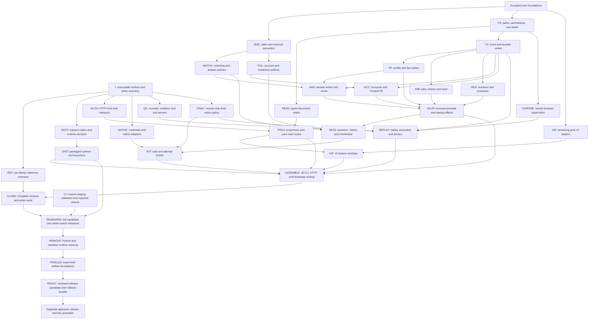

# End-to-end TypeScript migration map — approved

Prepared 2026-09-06 at `ae8339e`. Status: APPROVED, execution active (user agreement 2026-09-06).
This map refines the [existing architecture plan](../autonomous-typescript-migration-plan.md).
After approval it becomes the governing dependency schedule; the
[execution ledger](../migration-execution-state.md) records actual progress.
Completed work is reused, never counted as production activation.
The [acceptance contract](acceptance-contract.md) defines every node and subset's
required evidence, status transitions and migration-wide done condition.

The user approved the refined [agent-task DAG](remaining-migration-plan.md) with
“Begin.”, including rigorous local testing, PRs targeting staging and gated staging
merges. The existing acceptance contracts remain mandatory; live release and
activation are not included.

## Outcome and scope

Replace all shipped Python application code and handwritten browser/QA JavaScript
with modular TypeScript and reproducible emitted JavaScript. Retain required Swift,
HTML/CSS, and necessary shell/platform launch wrappers. Include Store, workspace,
CLI/task/attempt, account/credential flows, recorder/renderer, replay, Chrome,
promotion, privacy, final-action policy, packaging and release validation.
Development-only JS tools/tests may remain; shipped runtime JS must be emitted
from TS. Python reference tooling may be archived for provenance, but no required
install, launch, test or release path may invoke Python at completion.

Preserve CLI/HTTP/public exports, JSON values, durable bytes, permissions,
recovery, privacy and human-only final submission. Python and TS write only to
separate disposable clones until an atomic writer switch is rehearsed. No live
data experiment, dual writer, silent contract change or relaxed size policy.

## Dependency graph

Arrows are hard prerequisites. Nodes on separate branches may run concurrently.
I and REF provide incremental family contracts: a node needs its own accepted
contract, not every contract in the repository. Final gates require full coverage.

Reference edges to each implementation are implicit in the graph for readability
and mandatory in the table below. I inventories current source and package files;
the historical 98 Store commands are a starting observation, not a fixed ceiling.

## Node contracts and completion gates

All implementation nodes require I plus accepted REF coverage for their own family,
unless they are already accepted inert foundations. Every node also requires
scope checks, build/type/size checks, focused tests and independent review.
Table prerequisites supplement the graph; the stricter union applies.

| ID | Work and additional prerequisites | Required distinguishing evidence |
| --- | --- | --- |
| DONE | Existing numeric atoms, typed JSON, object/version validation, four resume helpers | Reuse `ae8339e` receipt: 73 focused tests, eight commit suites; inert only |
| I | Discover every parser command, route/method, startup effect, writer, launcher, shipped source and native boundary | Generated inventory matched to source and package; additions fail coverage audit; no unnamed residual bucket |
| REF | Start with I; capture one family ahead of its port, continuously | Exact response and state fixtures; versioned provenance; normal/error/no-op/conflict/recovery cases; no auto-refreshed goldens |
| SEM | DONE and current Python 3.12/3.13/3.14 evidence | Decide supported Unicode/error semantics; strict byte decode/BOM handling; missing/null/bool/number distinctions; caller recursion behavior; minimized regressions |
| FS | DONE | OS path and permission contracts; traversal, symlink/reparse substitution, missing/nonregular files, decode errors; read rejection leaves bytes and mtimes unchanged |
| READ | FS, SEM, typed JSON | Reads/projections from corrupt/future/legacy documents; no hidden startup writes; large integer and float identity preserved |
| TX | FS | Exclusive ownership, atomic JSON/JSONL, flush/rename ordering; at least eight simultaneous TS writers; injected write/disk/permission failures and every named crash boundary |
| MATCH | SEM | Python differential ranking, Unicode normalization, scoring/ties/limits, scope and sensitivity; no approximate subset accepted |
| POL | SEM | Pure account/readiness/config policies; deterministic clocks/randomness supplied explicitly; no implicit credential or authority lookup |
| AUTH | I plus HTTP contracts | Host/Origin/Bearer, loopback binding, status/headers/body, no-store, body limits, malformed encodings and unauthorized requests produce zero writes |
| PROJ | READ, AUTH | UI/CLI projection equality; pure reads separated from lazy bootstrap/recovery commands |
| UI0 | DONE | Port remaining pure helpers using unchanged JS as independent oracle; browser globals isolated |
| UIF | UI0, PROJ; mutation integration waits for owning domain | Split overview/jobs, answers/facts, resumes/activity/trash into disjoint packages; preserve state/events/auth/URLs and stale-response behavior; DOM and real-browser tests |
| PF | TX, READ, SEM | Split profile then facts if shared provenance; exact revision/provenance/no-op/conflict and protected-field behavior |
| JOB | TX, READ | Jobs, history and lifecycle/trash; references, restore/delete restrictions, append-only event behavior |
| RES | TX, READ | Resume bytes/digests, assignments, extraction requests/proposals, rejection preservation and recovery |
| ANS | TX, READ, MATCH, PF | Answers/reuse/cleanup, field mappings, stale provenance, scope and sensitivity; exact state and ranking |
| ACC | TX, READ, POL | Account records, settings, Trusted Fill, credential references; no secrets in logs or public projections |
| JOUR | PF, JOB, RES, ANS, ACC | One owner; sequential extraction/account/coordinator recovery packages; repeat recovery to stable state, exactly-once events, partial-write and stale-journal handling |
| SESS | JOUR, MATCH, POL | Sessions/claims/coordinator; lease expiration, lost process, concurrent claims and recovery; classify nominal reads that mutate |
| NATIVE | I; integration waits for ACC/ATT as needed | TS wrappers preserve necessary Swift; executable identity/attestation, cancellation, denial and credential redaction; real native tests distinguish mocks |
| QA | I; integration waits for ATT/SESS as needed | Recorder/renderer/test-server bounded packages; backpressure, capture identity, interruption, cleanup and sanitization; no live-account test substitute |
| FINAL | I, applicable authority contracts | Human-only final submission, authorization lifetime, one-winner concurrency, denial paths; zero unauthorized final actions |
| CHROME | FS | Discovery/ownership/control/supervision; replacement-process resistance, authenticated control, bounded shutdown and owned cleanup |
| REPLAY | QA, CHROME, TX, FINAL | Split replay, promotion, privacy into independent leaves then one transaction integration; signed tombstones, descriptor cleanup, rollback and leak canaries |
| ATT | SESS, NATIVE, FINAL, ACC | Task/attempt CLI and broker, heartbeat/bearer/lease lifetime, process loss and recovery; synthetic browser/native integration |
| HOST | I | Resolve supported host products, OS/CPU/version matrix and fresh-host access; verify existing support promises before narrowing; no inferred platform passes |
| DIST | HOST | Select proven runtime distribution; missing-runtime failure, installed critical bytes, offline cold start, signatures/digests where applicable; no install-at-launch |
| ASSEMBLE | All implementation families and DIST | Single owners for Store facade, CLI dispatch and workspace bootstrap; every public route mapped; packaged-browser/CLI shared-state walkthroughs |
| CLOSE | ASSEMBLE and complete REF/I | All inventory rows mapped to implementation and required test cells; enumerate all writers including QA/policy/startup; no unowned executable or missing caller |
| CI | Before REHEARSE; can prepare earlier | Restore staging triggers and valid current required contexts; check names actually produced; do not restore retired contexts or duplicate jobs |
| REHEARSE | CLOSE, DIST, CI | Full/platform/release gates on immutable candidate; separate clone differential writers; atomic switch, interrupted switch, upgrade, rollback and recovery under contention |
| REMOVE | REHEARSE | Port remaining required Python tests/tooling before deletion; remove obsolete runtime, compatibility wrappers and Python dependencies; retain archived reference evidence |
| FINALQA | REMOVE | Repeat full final-artifact gates without Python on PATH; fresh install/upgrade/offline start/rollback on every agreed native host cell; no skips in mandatory cells |
| READY | FINALQA and independent completeness review | Versioned artifact/hash, release notes, support matrix, logs and rollback bundle; no unresolved required coverage or review findings |

Domain implementation may begin with journal protocols fixed and mock recovery
interfaces, but is not accepted as durable until JOUR integration passes. No
domain worker independently edits shared journal dispatch. UIF may develop
against frozen contracts early; its integration acceptance waits for real routes.

## What runs in parallel

Three workers plus the coordinator is the current hard session limit. The DAG
usually exposes more ready work than available slots; do not manufacture tasks to
evade the limit. If actual capacity increases, the same independent nodes can fill
it after checking file ownership and host test capacity.

| Scheduling window | Example three-slot allocation | Coordinator work |
| --- | --- | --- |
| Next | FS implementation / independent FS oracle / SEM evidence | I inventory, shared interfaces, runtime access preparation |
| Foundations | TX / READ+PROJ / UI0 | REF gaps, AUTH contracts, HOST decision |
| Pure and early domains | MATCH / POL+ACC preparation / UIF | Independent review rotation; DIST package preparation |
| Durable domains | PF / JOB / RES | Journal protocol ownership, independent review and integration |
| Dependent domains | ANS / ACC / NATIVE | JOUR integration and remaining contract capture |
| Orchestration | SESS / QA / CHROME | REF completeness, DIST acceptance scheduling |
| Authority | ATT / REPLAY / FINAL integration review | CLI/facade assembly |
| Candidate | UI end-to-end / storage fault-recovery / platform-package acceptance | CLOSE, CI, immutable candidate orchestration |

These allocations are examples, not batch barriers. Dispatch any ready disjoint
node immediately; a blocked platform node must not stop unrelated work. Reserve
one rotating slot for HOST/DIST until runtime acceptance is resolved. Review uses
an existing slot after implementation finishes; it is never the author's approval.
Pure tests can overlap. Only one heavy browser/package/native runner owns this
development host at a time. Different authorized native hosts can run separate
platform cells concurrently without claiming a container is a native-host result.

## Rigorous tests without repeating everything

1. Worker edit: focused behavioral/differential tests, typecheck, emitted parity,
   source-size and allowed-file checks. Expected values must come from independent
   Python/JS behavior or reviewed fixed contracts, not the new implementation.
2. Commit: current eight-suite staged snapshot gate. New mandatory fast checks may
   change the count; preserve the gate's meaning, not a hardcoded suite count.
3. Node acceptance: independent adversarial review; fix, minimize and retain every
   counterexample; rerun affected checks after final edits. Record inherited evidence.
4. Integrated batch: cross-domain tests, matrix coverage/uniqueness and full emitted
   inventory once after integration. Inert leaves need not each run full browsers.
5. Push: current hook checks actual outgoing refs; broad changes require successful
   deep evidence bound to commit/base/tooling/environment. Existing 24-hour reuse
   is local convenience, never permission to skip a release/native acceptance cell.
6. Writer/candidate/final artifact: full portable suites, required native cells,
   real browser/CLI workflows, package install/upgrade/rollback and security gates.
   Final removal changes the artifact, so final-artifact verification runs again.

Each public command/route has required cells for success, invalid input, no-op,
conflict, concurrency, crash/recovery, privacy and platform behavior. A cell is
passed with evidence or inapplicable with reviewed rationale. Skipped, unavailable,
timed out, mocked-only or unrun is never passed. Inventory growth automatically
creates uncovered cells; CLOSE and FINALQA fail if any required cell is open.
Node I must deliver an executable coverage checker and a machine-readable node/
surface/scenario ledger before broad porting starts. Validate dependency IDs and
acyclicity, file ownership, registered nonempty suites and evidence references.
The coordinator runs it at node acceptance and candidate assembly; prose checklists
alone cannot close a gate. Contracts/tests must cover browser exports, document
types, journals and installed entry points as well as commands and routes.

For each package the ledger requires identity/base/dependencies/allowed files,
contract/input model/platform cells, independent oracle, commands/seeds/results/
internal skips/hashes, reviewer and reviewed SHA, acceptance outcome, and published
interfaces with newly ready downstream nodes. Missing fields leave the node open.
Native mock assertions do not certify an observed native account flow; opt-in
visible-browser tests require explicit scheduling on their applicable test cells.

Storage comparison includes exact durable bytes, file kinds, permissions, journal
events and restored state; unchanged reads/rejections include mtimes. Enumerate
fault points before every write/fsync/rename/journal/cleanup transition, including
initialization and read-triggered recovery. Fix clocks/nonces on disposable clones.
Only documented per-contract normalizations are allowed; none may hide semantic
differences, privacy leaks, permissions or persisted bytes.

Receipts record immutable base/head, files, commands, seeds, exact runtime and
Unicode/OS versions, durations, counts, failures/skips, log/artifact hashes and
review disposition. Retain private test material only in owned temporary fixtures;
checked-in receipts contain synthetic/value-free data.

Failure loop: retain evidence, reproduce minimally, compare unchanged base once
when needed, repair the owning node, rerun focused/affected gates. Two ineffective
repairs trigger independent root-cause review; no endless unchanged full reruns.
A baseline failure stays visible and cannot waive a final required gate.

## Approval, autonomy and durable continuation

Approval of this map authorizes implementation, synthetic testing, local commits,
reversible integration, refactoring within contracts, and preparation of reviewable
PRs/candidates. Proposed workflow: publish milestone PRs when their required gates
pass; merge only with user authorization. This publication scope must be part of
the agreement, not inferred from the earlier hooks PR.

Release/live activation remains a separate approval against the final artifact
and rollback evidence. Paid infrastructure, new credentials, changing a support
promise or choosing a different compatibility contract requires a concrete decision.
The coordinator continues independent nodes while a decision-dependent node waits.

Before starting each node, create a bounded package with exact allowed_files,
emitted counterparts, immutable base, dependencies, exports and test commands.
Split large nodes into child packages retaining the same prerequisites and parent
acceptance gate. One owner per shared facade/bootstrap/journal; new leaves depend
on primitives, never accidental reverse dependencies. No file exceeds 500 lines.

On resume: read this map and ledger, inspect branch/dirty state/workers/processes,
recover receipts, then dispatch ready packages. Update the ledger after accepted
nodes, new failures or graph changes. Never reconstruct status solely from chat.
Any substantive change to scope, contract or acceptance gate is recorded and
presented before dependent implementation proceeds.

End condition: READY, with all required coverage and platform cells satisfied,
no reachable Python in the required product/test/release paths, no unresolved
blocking review finding and verified final-artifact rollback. Do not stop at
"workers finished", "tests mostly pass" or "TypeScript files exist".
If execution spans sessions, resume from durable state. This document does not
schedule background execution or start an autonomous goal before agreement.

## Decisions to resolve early

- HOST must establish the actual supported Codex/Claude host, OS/CPU/version matrix
  and authorized native test environments. Current clean-host acceptance is empty.
- SEM must choose the supported reference behavior when Python versions differ;
  preserve existing product promises until evidence resolves them. Python 3.12
  is now available, but availability alone does not settle Unicode/caller semantics.
- Agree whether milestone PR publication is automatic after gates; merges and
  live release remain separately authorized under the proposed workflow.

These decisions block their dependent nodes, not inventory, contract capture or
independent pure implementation. No additional GoalBuddy board is required; if
one is requested later it must mirror this map rather than create a second plan.
