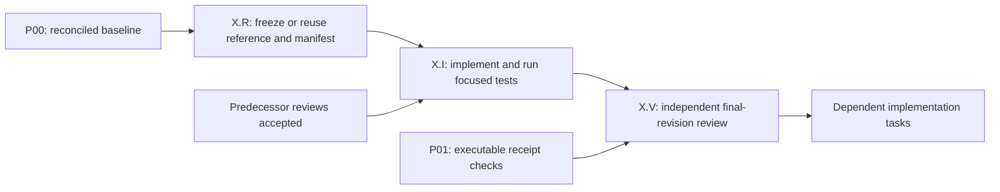

# Remaining migration — approved execution agreement

Prepared from `94e7d9c` on 2026-09-06. **Approved for execution by the user's
“Begin.” instruction.** Authority includes implementation, rigorous local testing,
local commits, isolated integration, PRs targeting staging and staging merges after
the agreed gates pass. Production release and live-data activation remain separately
approved. Failed tests, required reviews or server checks must never be bypassed.

This is a task-level refinement of the [approved map](end-to-end-map.md) and
[acceptance contract](acceptance-contract.md), not a relaxation of either.
The [ledger](../migration-execution-state.md) remains the history of actual results.

## Current position

The repository contains 37 emitted TypeScript modules and 315 inventoried source
rows. The latest text/copy checkpoint passed 153 focused tests without failures or
skips and all nine commit checks. These are useful inert foundations, not a
finished Store, workspace, runtime package or accepted migration subset.

The formal inventory still reports 446 surfaces, 4,380 unmapped requirement cells
and open whole-node acceptance. This planning graph maps all 35 implementation
parent families; it does **not** pretend to close those behavior cells. Historical
Python 3.14 QA failures, raw-filename/native gaps, clean-host/runtime distribution
and post-write rollback remain explicit work. P00 reconciles exact current status.

## The executable DAG

- [Complete task catalog](remaining/task-catalog.md): 115 proposed work packages,
  their prerequisites, ownership areas and task-specific acceptance criteria.
- [Package dependency diagram](remaining/dag.md): the full dependency graph.
- [Agent assignment diagram](remaining/agent-dag.md): the expanded 326-task graph.
- [Machine-readable plan](remaining/plan.json) and
  [expanded agent tasks](remaining/agent-tasks.json).
- Validate with `node tools/migration/check-remaining-plan.mjs`.

The graph contains 326 assignments, **not 326 persistent sessions**. An existing
agent can execute many non-overlapping tasks. Reference work often reuses an
unchanged accepted receipt; it does not mean recapturing every reference.
No claim is made that all future file manifests are dispatch-ready today.

Each implementation package X expands into three individual agent tasks:

A gate package has I and V only: its I assignment performs the named audit or
integration test instead of a domain port. Reviewers do not approve their own
implementation. R can prepare original-behavior fixtures before upstream ports
finish, but I must wait for its own R and every prerequisite V. Changed interfaces
invalidate affected reference and integration receipts.

P01 gates every V except the two bootstrap packages P00/P01. Native implementation
acceptance additionally depends on P05 and the agreed host matrix. No native
required cell can be satisfied by a deterministic test model.

## Scheduling and ownership

Use one coordinator plus up to three active workers under current capacity.
Two implementation/reference lanes plus a rotating independent reviewer usually
provide useful throughput. A ready DAG node can run immediately; lane headings
and milestone PRs are not artificial barriers. There is no requirement to create
new persistent tasks; a new session is an option for long isolated work when the
user explicitly requests it. Otherwise use subagents.

The first assignments after authorization are P00.I/V, then P01.I/V and the P02
support decision. In parallel after P00, S01.R, S02.R and U01.R can prepare or reuse
contracts. Once P01 passes, S01/S02/U01 implementations are independent. HOST/DIST,
QA/UI and storage/semantics offer separate continuing lanes; reserve capacity for
host/runtime work so it does not become a last-minute surprise.

Before any I task becomes Ready, R (or the coordinator for a gate) must freeze:

1. Immutable base, exact `allowed_files` including emitted counterparts and any
   oversized-file extraction targets; named interfaces and assigned surface IDs.
2. Exact scenario IDs and test commands, fixtures/seeds, supported environment
   cells, existing baseline-derived resource budgets and expected artifacts.
3. A maximum practical scope of eight production modules excluding mechanically
   emitted counterparts; tests/support must also fit one coherent behavior change.
   If discovery exceeds that scope, replace the I node with explicit child nodes,
   validate the amended DAG and retain the parent's integration gate before work.
4. An exclusive owner for overlapping files. G01 owns Store/CLI assembly, G02 owns
   workspace assembly, J04 owns startup dispatch and U07 owns UI bootstrap.
   S03 owns the coordinated typed-consumer change; its downstream S04/S05 wait.

Planning ownership descriptions are not glob write permissions. New leaves depend
on shared primitives; primitives/facades must not acquire accidental reverse
imports. Every scoped source/test/support/runtime file stays at most 500 lines;
existing exceptions can only shrink. The coordinator owns emission, inventory
reconciliation and integration unless explicitly reassigned to one worker.

Only one heavy browser/native/package/deep runner may own a host at a time.
Current runner serialization is per invocation, so the coordinator enforces this
until P04's host-wide lease is implemented. Different authorized hosts may run
independent native cells concurrently. Pure focused tests can overlap.

## Acceptance of every individual assignment

| Assignment | Acceptance and handoff |
| --- | --- |
| X.R | Independent original-Python/JS or reviewed fixed oracle; exact scenarios, bytes/errors/state and permitted normalizations; immutable source/runtime provenance; file/test/host manifest; reuse rationale for unchanged evidence. No auto-refreshed golden output. |
| X.I | Declared interface implemented within allowed files; exact applicable success/invalid/missing/no-op/privacy/conflict/concurrency/interruption/recovery/platform cases; focused tests, types, reproducible emission, size and inventory pass. Record counters, skips and limitations. |
| X.V | Independent review of final immutable diff and adversarial coverage; each finding fixed and rechecked; receipt schema validates inputs, outputs, logs/hashes and actual environment. Required missing, skipped, flaky or timed-out cells prevent acceptance. |
| Gate I/V | Run the catalog's named integrated/audit criteria on one immutable candidate, then independent review. Member passes alone cannot satisfy cross-node behavior. |

A discovered counterexample becomes a minimized regression. Two ineffective fixes
trigger independent diagnosis. Compare an unchanged baseline once when useful;
do not repeatedly rerun an unchanged whole suite or waive a final gate because
Python already fails. Preserve useful prior evidence with exact dependency identity.

Passing test counts, line coverage and merged PRs do not define completion.
P01/P05 must enforce required scenario cells, including child-test skips, not just
suite exit status. No live Store or real applicant data is used; Python and TS
writers remain confined to separate owned synthetic clones until switch rehearsal.

## Local testing setup and tiers

Native `.githooks/pre-commit` and `.githooks/pre-push` are installed and executable
for this worktree. Husky is not installed. These hooks already supply the requested
behavior; retaining them avoids replacing a working runner solely for its wrapper.
Their 30 focused regression tests passed with zero skips during this plan audit.
The [testing protocol](../local-testing-protocol.md) documents exact commands.

| Tier | When | What runs |
| --- | --- | --- |
| Edit | Each meaningful worker change | Owned focused behavioral tests; relevant types/build/size checks. No automatic full browser run for an inert leaf. |
| Pre-commit | Exact staged snapshot | Seven fast matrix suites plus emitted build and local-link checks: nine checks. Index changes during validation invalidate success. |
| Pre-push | Actual outgoing refs and comparison bases | Fast plus reviewed affected contracts. Unknown/shared/tooling/dependency changes and tags escalate; broader work requires an explicit successful deep run first. |
| Deep | Integrated outgoing commit needs it | Selected heavier suites, one runner per host; full/platform/release selection for broad changes. Run once per unchanged candidate and reuse matching local receipt. |
| Node/subset | Independent acceptance | Exact required behavioral/native cells and final-revision review; stricter provenance and no required skips. |
| Final conversion | G09–G13 | Full installed candidate, cutover/rollback, then fresh post-removal artifact tests without Python. Local hook receipts cannot replace these gates. |

The existing 24-hour receipt is only a maximum reuse window for **the same tested
commit, base, test policy, dependency identity and recorded environment**. Any
relevant identity change requires a new run; time alone never makes altered code
safe. Native acceptance requires richer identities than the current hook receipt.
P03 adds reviewed consumer-aware mappings, P04 coordinates heavy runners and P05
makes native/child-skip evidence enforceable. Until then, conservative escalation
and coordinator ownership remain in force. Do not bypass hooks to make progress.

Staging's automatic Validate Plugin workflow remains excluded in the checked-out
configuration; release validation still includes staging. The live staging
ruleset was also read during this audit: PRs, deletion protection and non-fast-
forward protection remain required, but there is no required-status-check rule.
This is not a freeze of all Python CI. Current server rules must be rechecked
before merge authority is used. T05 restores actual produced required contexts and proves failure blocks
merge; no phantom retired checks or main/release policy changes are inferred.

## Milestones and granted authorization

Approved PR bundles target **staging**, grouped by coherent accepted packages:

| Bundle | Contents and merge gate |
| --- | --- |
| M0 | P00–P05 evidence/testing/runtime decisions as they become ready; validation schema and hook tests pass. |
| M1 | S/F/A foundations and matching/policy; each inert/activated scope explicit, consumer regression tests pass. |
| M2 | D/J/C state and coordinator packages; domain contracts first, durable completion only after journal integration. |
| M3 | U/W/N/Q interface, native and authority packages; pure work can land early, integrated claims wait for real adapters/routes. |
| M4 | B and G01–G08 installed assembly and complete coverage; exact installed candidate plus storage/UI/authority gates. |
| M5 | T and G09/G10 test/tool conversion, restored CI and switch/rollback rehearsal. Test conversions can develop much earlier. |
| M6 | G11–G13 deletion, final Python-free artifact and independent conversion handoff. |

These are review bundles, not fixed sequential waves. The user has granted authority for: local tests/commits, isolated integration,
pushes to `codex/*`, PR creation with base `staging`, bounded repairs and staging
merges only after current required local/server/review gates. Rebase or dependency
changes require affected validation of the actual proposed merge result. Never
merge another active worker's unfinished changes. Record PR/head/base and receipts.

No permission is inferred to bypass failed gates, weaken tests/branch protection,
change support promises, buy infrastructure, access real accounts, merge to main,
publish a release or switch live data. Release/live activation remains outside
this graph unless a later agreement explicitly changes that boundary.

## What final conversion means

G13.V passes only when S0–S7 of the acceptance contract are satisfied:

- Every current in-scope CLI, HTTP, browser, document, journal, startup and installed
  entry point has an accepted TS implementation and all required behavior cells.
- All shipped JS is reproducibly emitted from TS; required install/launch/build/
  test/release paths invoke no Python and have no Python fallback. Retained Swift,
  necessary shell wrappers and HTML/CSS remain allowed by the existing scope.
- The exact rebuilt artifact after deletion passes all required supported native
  host cells, fresh install, upgrade, offline use, cleanup and resource budgets.
- Cutover interruption/contention preserves a single writer. After representative
  TS writes, rollback in a separate clone restores the preserved Python runtime
  and usable data. The TS candidate itself is tested with Python unavailable.
- Privacy, durable schemas/bytes/permissions and human-only final submission remain
  intact; no blocking independent-review finding or missing mandatory cell remains.
- Artifact hashes, support matrix, evidence index, release notes and the rehearsed
  rollback bundle are delivered. Publication/live activation is a separate event.

Open decisions are the precise supported host matrix and authorized test access,
profile choices where original runtimes differ, and any future extension beyond the granted staging
merge authority. Preserve existing promises while decisions are pending. These
block dependent acceptance, not unrelated planning or reference preparation.
