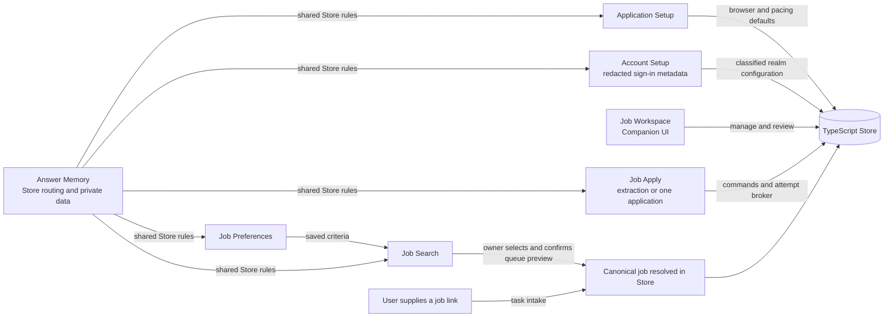
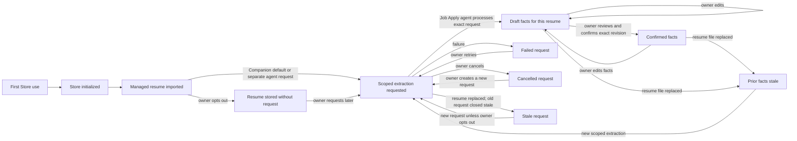
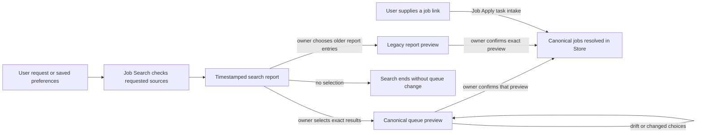
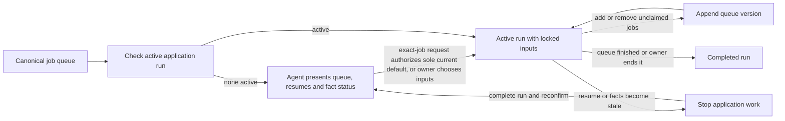

# Job Apply workflow map

This is the shared map for the packaged TypeScript workflow. State names in the diagrams describe what the owner or agent can do next; they are not extra Store fields. The Store is authoritative for persisted records and revisions. Companion and the agent command router use that same Store. A browser tab and a search report are not application state.

## Skill relationships

Job Workspace launches the UI; it does not start Job Apply. Job Search, Job
Preferences, Application Setup, and Account Setup are optional for a user who already has a job
link. The seven packaged skills are [Answer Memory](../SKILL.md), [Application
Setup](../../application-setup/SKILL.md), [Account Setup](../../account-setup/SKILL.md), [Job Preferences](../../job-preferences/SKILL.md),
[Job Search](../../job-search/SKILL.md), [Job Workspace](../../job-workspace/SKILL.md),
and [Job Apply](../../job-apply/SKILL.md).

## 1. First use and resume facts

| Transition | Skill or surface | Persisted evidence and guard |
| --- | --- | --- |
| Initialize and import | Answer Memory commands or Job Workspace → Resumes | Private managed file and `resumes.json` record. Companion queues a scoped request by default unless the owner opts out; after CLI import or replacement the agent makes a separate request unless the owner opted out. Replacement closes an open request as stale. |
| Process request | Job Apply extraction route | Exact requested resume and revision; completion writes a draft to that resume's `resume-facts.json` history. The UI cannot perform extraction. |
| Review and confirm | Job Workspace → Resumes → Facts, or Answer Memory owner-directed command | The owner reviews draft revision N; confirmation appends a distinct, immutable confirmed revision N+1. Job selection uses the confirmed revision. Editing appends a new draft; replacement makes older content-bound facts stale. |

Legacy applicant-wide profile facts and reusable application answers remain separate. A confirmed fact revision is necessary for the new scoped application route, but does not choose a job or authorize browser work.

## 2. Search and queue jobs

| Transition | Skill or surface | Persisted evidence and guard |
| --- | --- | --- |
| Save criteria | Job Preferences or Job Workspace → Facts | `profile.preferences` with revision checking; a search can also use request-only criteria without saving them. |
| Search | Job Search | Timestamped Markdown report in the compatibility search directory; it is not the canonical queue. Missing source data stays visible as unknown. |
| Queue chosen results | Job Search queue intake | Owner confirms the exact `job-upsert-preview`; `job-upsert-commit` uses that input and preview token. Drift requires another preview and confirmation. |
| Import an older search report | Job Search legacy queue intake | Owner selects exact report entries, reviews their `legacy-jobs-preview`, and confirms its token before commit. This is an optional migration path. |
| Enter one supplied URL | Job Apply intake | `task intake` creates, updates, or resolves an existing canonical job before browser work; search is optional. |

## 3. Start and maintain an application run

| Transition | Skill or surface | Persisted evidence and guard |
| --- | --- | --- |
| Start run | Job Apply intake, with review in Job Workspace → Resumes | `application-run-start` records one managed resume, content revision, confirmed fact revision, and initial queue. One exact-job manual-review request may authorize the sole active default resume with current confirmed facts; ambiguous or multiple-resume cases require an explicit choice. Only one run is active. |
| Update queue | Job Apply intake | `application-run-update` replaces the full queue at an exact run revision and appends the new version. It cannot change resume or facts or remove an actively claimed job. |
| End run | Job Apply intake | `application-run-complete` closes the exact active revision. A new resume or fact revision requires a new run and fresh chat confirmation. |

## 4. One job within an application run

```mermaid
flowchart LR
  Run[Active application run] -->|exact job is in current queue| Job[Exact canonical job chosen]
  Job -->|task select passes run-aware preflight| Ready[Ready]
  Ready -->|attempt start acquires exact revision| Claimed[Claimed attempt]
  Claimed -->|open and inspect visible form| Form[Exact form observed]
  Form -->|owner grants bounded fill consent| Filling[Agent fills and verifies]
  Filling -->|missing input or changed inputs| NeedsInfo[Needs Attention; claim released]
  NeedsInfo -->|pending answer resolved; run inputs current| Ready
  NeedsInfo -->|run inputs stale| Stop[Complete run and reconfirm]
  Filling -->|current-form readiness passes| Review[Awaiting owner review; claim released]
  Review -->|owner submits externally and confirms outcome| Applied[Submission recorded]
  Review -->|owner confirms not submitted; explicit restart| Claimed
  Claimed -->|lease expires| Expired[Expired same-job claim]
  Expired -->|explicit same-job recovery| Claimed
  Claimed -->|claimless interruption| Interrupted[Interrupted job needs attention]
  Interrupted -->|owner resolves exact state| NeedsInfo
```

| Transition | Skill or surface | Persisted evidence and guard |
| --- | --- | --- |
| Choose job | Job Apply intake | The exact job must be in the active run's latest queue version. Queue membership can change without changing the run inputs. |
| Select and acquire | Job Apply `task select` then `attempt start` | Preflight and claim recheck the run selection, queue membership, confirmed facts, and managed file; the attempt broker retains claim authority privately. |
| Fill or pause | Job Apply visible browser and `attempt` clients | Claiming does not authorize entry. Inspect the exact visible form, then obtain bounded fill consent; a new form instance or material scope change needs renewed consent. Progress saves value-free references. `needs_info` releases the claim before waiting for the owner. |
| Hand off | Job Apply readiness check and `attempt handoff` | A current-form packet must pass Store checks before `awaiting_review`; the agent leaves final submission untouched. |
| Finish | Owner in the external application and Job Workspace activity | Only the owner submits. Record `applied` only after the owner confirms that submission. |
| Recover or restart | Job Apply recovery route | A pending answer can resolve directly to Ready while the run selection stays current. An expired same-job claim needs explicit recovery; a reviewed job restarts only after the owner confirms it was not submitted. |

Application question answers live in the separate reusable answer library. Job revisions and queue changes do not require resume reconfirmation. A resume content or fact revision change ends the run before another attempt. An interrupted claim is handled through explicit recovery, never silently replaced.

## Keep the map current

Update the affected diagram and transition row whenever a skill handoff or Store state changes. Check the operative rules in [resume handling](resumes.md), [search queue intake](../../job-search/references/queue.md), [application intake](../../job-apply/references/intake.md), [browser consent](../../job-apply/references/browser.md), [handoff](../../job-apply/references/application.md), and [recovery](../../job-apply/references/recovery.md). These detailed references govern execution; correct this map if it falls out of sync.
